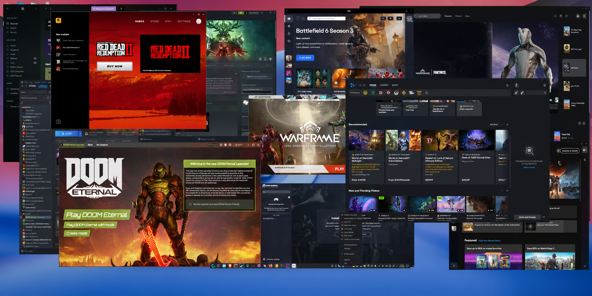

What is Proton Wineland?
-------------------------

Proton Wineland is an effort to solve Linux gaming problems through complete,
high-quality solutions rather than accumulating game-specific hacks and
workarounds. Its goal is to address issues that are genuinely solvable when the
necessary time and care are invested.

The project began with the lack of robust Wayland support. Since then, it has
grown beyond launchers to address broader compatibility, rendering, input, and
media issues across games and applications.

While upstream compatibility was an early consideration, it should not limit
what the project can achieve. Proton Wineland's focus is the quality of the
solution and the experience it delivers to Linux gamers.


What does Proton Wineland offer over other Proton versions?
-----------------------------------------------------------

Proton Wineland is not intended to change how every game runs. Its advantages
are most noticeable when a game or launcher runs into Wayland-specific problems
that other Proton versions may work around only partially.

It can provide:

- More reliable Windows game launchers, including Chromium and CEF-based
  applications such as Battle.net, Ubisoft Connect, Rockstar Games Launcher,
  and the native Windows Steam client.

- Better fullscreen, borderless-window, minimise, maximise, restore, alt-tab,
  and monitor-switching behaviour, particularly in multi-monitor and
  mixed-scaling setups.

- Correct rendering for overlays, popups, login windows, and other content
  created by a separate Windows process from the visible game window.

- Improved video and media playback compatibility in applications that use
  Windows Media Foundation.

- More accurate mouse and keyboard behaviour when a game is fullscreen, scaled,
  or moved between monitors.

- Better integration with Wayland desktops, including Windows tray icons,
  application menus, and compatible HDR and colour-management paths.

These improvements work automatically where they are applicable. They are
intended to solve underlying compatibility problems rather than require
per-game environment variables or launch-option workarounds.

These benefits depend on the game, GPU driver, compositor, and desktop setup.
A game that already works well with another Proton version may not show a
visible difference.


What does it improve?
----------------------

Proton Wineland aims to make Windows games and their supporting applications
feel at home on a Wayland desktop. It improves launcher compatibility,
fullscreen behaviour, and common window actions such as minimising, maximising,
restoring, and moving games between monitors. It also works to improve video
and media playback, and the rendering of overlays or companion windows,
including cases where those windows are created by a separate process.


How do I activate the Wayland features?
----------------------------------------

You do not need to enable anything manually. Proton Wineland enables Wayland by
default by setting `PROTON_ENABLE_WAYLAND=1`, so games and supporting
applications run through Wayland automatically.


How is the initial monitor selected?
------------------------------------

At launch, Proton reads KDE's or GNOME's configured primary monitor, niri's
focused monitor, or COSMIC's preferred display for X11 games. COSMIC's preference
is reused for native Wayland games; this does not switch them to Xwayland.
The query runs once, does not change desktop settings, and leaves Wine's default
unchanged if the desktop is unsupported or no unambiguous answer is available.

An explicit `WAYLANDDRV_PRIMARY_MONITOR` always takes precedence, for example:

```sh
WAYLANDDRV_PRIMARY_MONITOR=DP-2 %command%
```


How do I resize a game's cursor?
--------------------------------

For custom bitmap cursors supplied through Wine, set a size multiplier in the
Steam launch options, for example:

```sh
PROTON_WAYLAND_CURSOR_SCALE=2 %command%
```

This doubles the cursor size without changing game resolution or mouse
sensitivity. Fractional values from `0.25` to `8` are supported; the default is
`1`, and invalid values leave the default unchanged. The setting is read when
Wine initializes the Wayland pointer and requires cursor viewport scaling
support from the compositor.

Compositor-provided cursor shapes, including the Steam overlay cursor, keep
their desktop-controlled size. Cursors drawn into the game image cannot be
resized by this option.


How do I use OptiScaler nightlies?
---------------------------------

The existing stable selection remains `PROTON_USE_OPTISCALER=1`. To use the
latest official nightly, set this Steam launch option:

```sh
PROTON_USE_OPTISCALER=nightly %command%
```

To pin a published nightly instead:

```sh
PROTON_USE_OPTISCALER=nightly-20260906 %command%
```

Nightlies come directly from [OptiScaler's nightly releases](https://github.com/optiscaler/OptiScaler-nightly/releases).
The downloader checks release metadata once per launch and verifies the archive's
SHA-256. When extraction is needed, it downloads a pinned, checksum-verified
[official Linux 7-Zip](https://github.com/ip7z/7zip/releases/tag/26.03) into the
protonfixes cache, retaining its license notices. The static host executable
supports x86-64 and ARM64; no system 7-Zip or additional Python packages are needed.
It only runs during installation or updates, not while the game is running.

Nightly-bundled DLLs stay separate from Proton's managed DLSS/XeSS/FFX files.
Updates are staged before replacement, with rollback on installation errors.
An unsuccessful update can use a valid existing installation; an explicit nightly
tag only permits that exact tag. Offline validation needs no GitHub connection.
As with stable updates, previous INIs are saved as `.ini.old`, and
`PROTON_OPTISCALER_CONFIG` is reapplied. Switching back to `1` selects stable again.


What does it not promise?
-------------------------

No Proton version can guarantee that every game will work perfectly. Not every
problem originates in Proton or can be solved within Wine. Issues may also come
from the game itself, graphics drivers, the desktop compositor, or another part
of the Linux graphics stack.


Is it experimental?
-------------------

Yes, but "experimental" does not mean inherently unstable. Proton Wineland
takes a different approach from the usual pattern of relying on environment
variables, command-line parameters, and game-specific Wine workarounds to make
individual titles run.

Where possible, it aims to solve the underlying problem in a durable way. This
does not mean the project is bug-free, including in newly added areas, but its
experimental nature does not come with an intended trade-off of reduced
stability. In some situations, it may even be more stable than other Proton
versions.


How is artificial intelligence used?
------------------------------------

AI tools are a regular part of Proton Wineland's development process. I use
them to analyse logs, investigate problems, review changes, and help fix or
generate code when I consider that appropriate.

Before delivery, every commit goes through an AI-assisted review. I examine
the findings and decide whether the suggested changes are technically sound
and suitable for the project. When they are, I may let the AI modify the code
and then review the result again.

AI does not replace engineering judgement, testing, or responsibility for the
code that is delivered. Used thoughtfully, however, it is a valuable software
development tool that can accelerate investigation and help identify problems
that might otherwise be missed.


What is the relationship to CachyOS Proton?
-------------------------------------------

Proton Wineland is currently based on CachyOS Proton. Proton is made up of many
components, with Wine being only one of them. Most Proton Wineland changes are
made to Wine, while CachyOS Proton provides the surrounding build, integration,
and runtime framework.

Early on, Proton Wineland was regularly rebased onto the latest CachyOS
branches. As its Wayland work expanded, rebasing the Wine component became
increasingly difficult. Repeatedly resolving the growing number of conflicts
began to destabilise the codebase, so Proton Wineland now maintains its Wine
work independently and selectively cherry-picks compatible upstream and
bleeding-edge changes.

An early possibility was contributing the Wineland changes directly to CachyOS.
As the project grew in scope and followed its own technical direction,
independent development became the better fit. This gives Proton Wineland room
to pursue broader solutions when they can improve the Proton experience.

CachyOS has its own development priorities and established relationships with
the Wine development process. Proton Wineland complements that work with an
independent focus. I have great respect for the CachyOS maintainers and
developers, and value their tremendous work.


Can Proton Wineland be merged into other larger Proton projects?
---------------------------------------------------------------

I cannot speak for the plans of other projects. Proton Wineland is open source,
and anyone is free to use or adapt parts of it. For example, GE-Proton has
already adopted its Status Notifier Item support.

Adopting the entire project would be more difficult because the changes span a
broad part of Wine's Wayland, rendering, and compatibility stack. The
cross-process rendering framework is already relatively mature, but taking it
wholesale could make it harder for another project to integrate future upstream
Wine changes.


What about upstream Wine and Valve's Wine work?
------------------------------------------------

A full merge into upstream Wine or Valve's Wine work is currently unlikely. My
understanding is that Wine is pursuing its own approach to Wayland
cross-process rendering, which differs from Proton Wineland's design. I have
not investigated the details of that work myself, so I do not want to speculate
beyond that.

The same is likely true for Valve's Wine work. Valve and upstream Wine have
closely connected development efforts, with contributors working across both
projects. Proton Wineland is therefore best understood as an independent
project that can share ideas and individual improvements where appropriate,
rather than something expected to be merged wholesale.


Original Proton documentation
-----------------------------

The original Proton documentation, including build instructions, is available
in [README_PROTON.md](README_PROTON.md).
